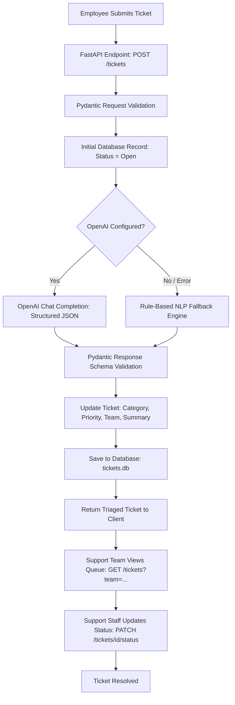

# Intelligent IT Support Ticket Assistant

An AI-powered IT support ticket management and automated triage backend system built with **Python 3.11+**, **FastAPI**, **SQLAlchemy**, **Pydantic v2**, and **OpenAI**.

---

## 📌 Business Problem

In enterprise environments, internal IT helpdesks receive dozens of employee issue reports daily—ranging from broken monitors to company-wide VPN failures. Traditional manual triage introduces operational friction:
- **Triage Delay**: Tickets sit unread in a generic queue until a human dispatcher reviews them.
- **Inconsistent Categorization**: Different employees describe the same problem inconsistently, leading to misclassified categories.
- **Queue Misrouting**: Tickets are frequently assigned to the wrong team (e.g., routing a VPN tunnel issue to Hardware Support instead of Network Support).
- **Subjective Priority**: Employees often mark all issues as "Urgent," making genuine business-critical outages hard to distinguish from minor requests.

---

## 💡 Solution

The **Intelligent IT Support Ticket Assistant** automates the first-touch triage process:
1. **Validates** incoming tickets using strict Pydantic schemas.
2. **Analyzes** issue descriptions using NLP and OpenAI (with an offline fallback engine).
3. **Classifies** the issue into controlled categories and extracts the specific issue type.
4. **Evaluates Priority** based on objective business-impact rules (Critical, High, Medium, Low).
5. **Generates** a factual, concise summary of the issue.
6. **Recommends & Routes** the ticket to the correct IT support team.
7. **Exposes** RESTful CRUD endpoints, team queue filters, and live operational metrics for support dashboards.

> **Note on Performance Metrics**:
> Quantified metrics such as "X% triage time improvement", "cost savings", or "accuracy percentage" are **Not measured** in this initial development release.

---

## 🏗️ Architecture & Workflow



---

## 🛠️ Technology Stack

| Component | Technology | Description |
| :--- | :--- | :--- |
| **Language** | Python 3.11+ | Modern, strongly-typed Python backend |
| **Web Framework** | FastAPI | High-performance ASGI framework with auto-generated OpenAPI |
| **Server** | Uvicorn | Lightning-fast ASGI production web server |
| **Data Validation** | Pydantic v2 & `email-validator` | Strict typing, email RFC verification, and JSON serialization |
| **ORM & Database** | SQLAlchemy 2.0 & SQLite | Relational database mapping (PostgreSQL/MySQL ready) |
| **AI / NLP** | OpenAI Python SDK | Structured JSON classification via `gpt-4o-mini` |
| **Configuration** | `python-dotenv` | Secure environment variable and secret handling |
| **Testing** | Pytest & HTTPX | Automated unit and integration testing with mocked AI |

---

## 📂 Project Structure

```text
it-support-ticket-assistant/
│
├── app/
│   ├── __init__.py           # Package initializer
│   ├── config.py             # Centralized settings and environment variables
│   ├── database.py           # SQLAlchemy engine, SessionLocal, and get_db dependency
│   ├── exceptions.py         # Global exception handlers and error contracts
│   ├── main.py               # FastAPI application, lifespan, and CORS setup
│   ├── models.py             # SQLAlchemy ORM database models (Ticket)
│   ├── schemas.py            # Pydantic schemas, Enums, and validation rules
│   │
│   ├── routes/
│   │   ├── __init__.py
│   │   └── tickets.py        # REST CRUD endpoints, filtering, and stats
│   │
│   ├── services/
│   │   ├── __init__.py
│   │   └── ai_service.py     # OpenAI client, structured parsing, and fallback
│   │
│   └── utils/
│       ├── __init__.py
│       └── prompts.py        # System prompts, category definitions, and templates
│
├── tests/
│   ├── __init__.py
│   ├── conftest.py           # In-memory test DB and TestClient fixtures
│   └── test_tickets.py       # 13 automated unit and integration tests
│
├── .env                      # Local secrets and config (git-ignored)
├── .env.example              # Environment variables template
├── .gitignore                # Git ignore rules for venv, secrets, and DB
├── requirements.txt          # Python dependencies
└── README.md                 # Project documentation
```

---

## 🚀 Getting Started

### 1. Prerequisites
- Python 3.11 or higher installed on your machine.
- Git installed.

### 2. Clone and Setup Environment
```bash
git clone https://github.com/your-username/it-support-ticket-assistant.git
cd it-support-ticket-assistant

# Create virtual environment
python -m venv .venv

# Activate virtual environment (Windows PowerShell)
.\.venv\Scripts\Activate.ps1

# Activate virtual environment (Linux / macOS)
source .venv/bin/activate

# Install dependencies
python -m pip install --upgrade pip
python -m pip install -r requirements.txt
```

### 3. Configure Environment Variables
Copy `.env.example` to create your local `.env`:
```bash
cp .env.example .env
```

Edit `.env` with your settings:
```ini
# Optional: Provide your OpenAI API key for live LLM classification
# If left as placeholder, the system automatically uses the intelligent rule-based triage fallback
OPENAI_API_KEY=your_openai_api_key_here

# Database URL (defaults to SQLite for local development)
DATABASE_URL=sqlite:///./tickets.db
```

### 4. Run the Application
```bash
uvicorn app.main:app --reload --port 8000
```

The application will be running at:
- **API Base URL**: `http://127.0.0.1:8000`
- **Interactive Swagger UI**: `http://127.0.0.1:8000/docs`
- **ReDoc Documentation**: `http://127.0.0.1:8000/redoc`

---

## 📡 API Endpoints

| Method | Endpoint | Description |
| :--- | :--- | :--- |
| `GET` | `/health` | Health check and service status |
| `POST` | `/tickets` | Create a new ticket with automated AI triage |
| `GET` | `/tickets` | List tickets with filtering (`?status=`, `?category=`, `?priority=`, `?team=`) |
| `GET` | `/tickets/stats/summary` | Get aggregated ticket queue and operations statistics |
| `GET` | `/tickets/ai/status` | Check AI service connectivity and configuration status |
| `GET` | `/tickets/{ticket_id}` | Retrieve a specific ticket by ID |
| `POST` | `/tickets/{ticket_id}/analyze` | Trigger on-demand AI analysis/re-classification |
| `PUT` | `/tickets/{ticket_id}` | Update ticket details |
| `PATCH` | `/tickets/{ticket_id}/status` | Update ticket lifecycle status |
| `DELETE` | `/tickets/{ticket_id}` | Delete a ticket |

---

## 🧪 Example API Request & Response

### Request: Create Support Ticket
`POST /tickets`
```json
{
  "employee_name": "Anjan Sai",
  "employee_email": "anjan@example.com",
  "issue_description": "My laptop cannot connect to the company VPN. I have tried restarting several times, but the VPN is still not connecting and I need access to the internal server."
}
```

### Response (HTTP `201 Created`):
```json
{
  "id": 1,
  "employee_name": "Anjan Sai",
  "employee_email": "anjan@example.com",
  "issue_description": "My laptop cannot connect to the company VPN. I have tried restarting several times, but the VPN is still not connecting and I need access to the internal server.",
  "category": "VPN",
  "priority": "High",
  "issue_type": "Connectivity",
  "ai_summary": "Employee is unable to connect to the company VPN and requires internal server access.",
  "assigned_team": "Network Support",
  "status": "Open",
  "created_at": "2026-10-08T19:30:00.000Z",
  "updated_at": "2026-10-08T19:30:00.000Z"
}
```

---

## 🧪 Running Automated Tests

The project includes 13 automated tests using `pytest` and an isolated in-memory SQLite database. All external OpenAI API requests are mocked to ensure instant, reliable test execution.

```powershell
pytest -v
```

Expected result:
```text
============================= test session starts =============================
platform win32 -- Python 3.11.6, pytest-9.1.1
collected 13 items

tests/test_tickets.py::test_health_check PASSED                          [  7%]
tests/test_tickets.py::test_create_ticket_success PASSED                 [ 15%]
tests/test_tickets.py::test_get_tickets_list PASSED                      [ 23%]
tests/test_tickets.py::test_get_ticket_by_id_success PASSED              [ 30%]
tests/test_tickets.py::test_get_ticket_not_found PASSED                  [ 38%]
tests/test_tickets.py::test_update_ticket PASSED                         [ 46%]
tests/test_tickets.py::test_update_ticket_status PASSED                  [ 53%]
tests/test_tickets.py::test_delete_ticket PASSED                         [ 61%]
tests/test_tickets.py::test_validation_error_invalid_email PASSED        [ 69%]
tests/test_tickets.py::test_validation_error_short_description PASSED    [ 76%]
tests/test_tickets.py::test_team_queue_filtering PASSED                  [ 84%]
tests/test_tickets.py::test_operational_statistics PASSED                [ 92%]
tests/test_tickets.py::test_mocked_openai_triage PASSED                  [100%]

============================= 13 passed in 0.25s ==============================
```

---

## 🔮 Future Improvements

1. **Slack & Microsoft Teams Webhooks**: Dispatch automated notifications directly to IT team channels when a `High` or `Critical` ticket is submitted.
2. **Employee Authentication**: Add OAuth2 / JWT authentication to restrict ticket submission to authenticated corporate staff.
3. **PostgreSQL & Alembic**: Migrate from SQLite to PostgreSQL with Alembic database schema migrations.
4. **SLA Tracking**: Add automated SLA timers to monitor ticket resolution speed per priority tier.
